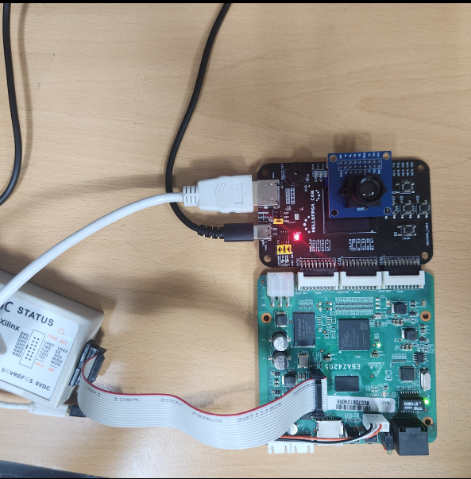
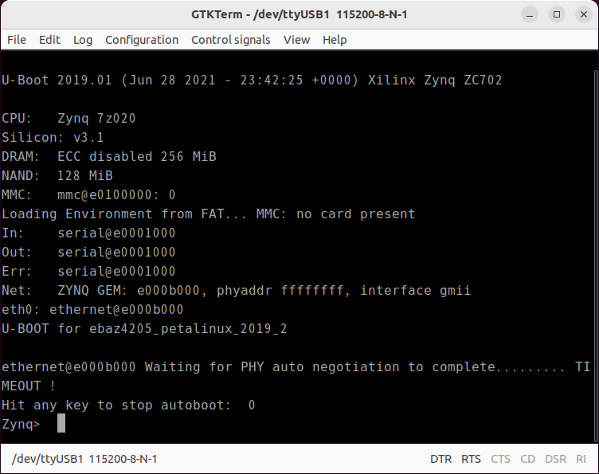
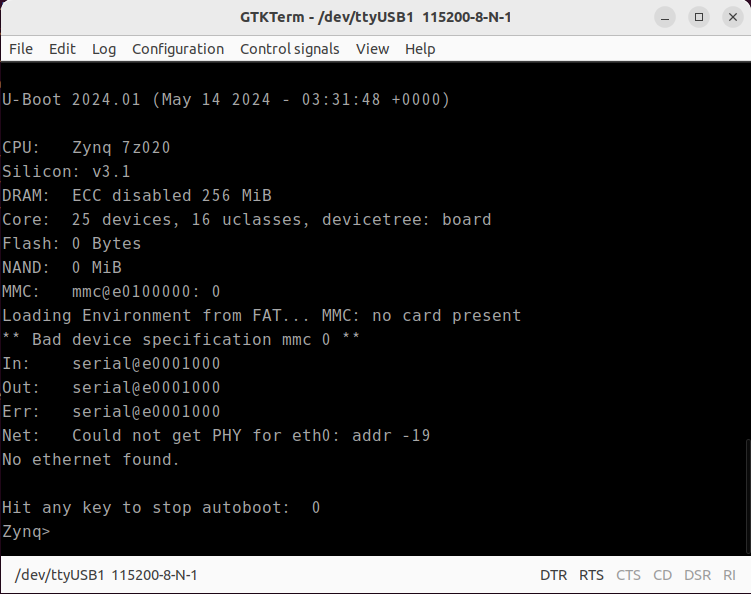

# Zynq-7000 Tutorial

This tutorial provides comprehensive examples for Zynq-7000 development, covering both hardware design in Vivado and software development in Vitis.

## Overview

The 05_Zynq7000 tutorial includes:

### Hardware Design (Vivado)
- **Block Design**: Complete Zynq PS configuration with peripherals
- **GPIO Configuration**: External GPIO and EMIO setup
- **Peripheral Integration**: UART, Ethernet, Timer, and other peripherals
- **Bitstream Generation**: FPGA programming files

### Software Applications (Vitis)
- **LED External Test 1**: Direct GPIO register access for LED control
- **LED External Test 2**: Xilinx GPIO driver-based LED control  
- **lwIP Echo Server**: Network echo server using lwIP stack
- **Memory Test**: Comprehensive memory validation
- **Peripheral Test**: Multi-peripheral functionality testing
- **PS LCD**: LCD display control via PS GPIO

## Hardware Requirements

- Zynq-7000 based development board (EBAZ4205)
- LEDs for testing applications
- Ethernet connection for network applications
- LCD display for PS LCD application
  - [Adapter with LCD](https://ja.aliexpress.com/item/1005006074065888.html) (recommended)
- JTAG or UART connection for programming/debugging

## Software Requirements

- Xilinx Vivado Design Suite
- Xilinx Vitis IDE
- Zynq-7000 BSP (Board Support Package)
- Required Xilinx driver libraries

## Getting Started

### Vivado 프로젝트 재생성

`vivado/project_new/`는 git에서 제외됩니다. 아래 스크립트로 재생성하세요.

```bash
cd /path/to/NexEBAZ4205_Zynq7000

# 1. 프로젝트 생성 (PS7 설정 + AXI GPIO 블록 디자인)
vivado -mode batch -source vivado/create_project.tcl

# 2. 합성 → 구현 → 비트스트림 → XSA 생성
vivado -mode batch -source vivado/run_impl.tcl
```

완료 후 생성되는 파일:
- `vivado/project_new/ebaz4205_zynq.runs/impl_1/design_1_wrapper.bit` — 비트스트림
- `vivado/project_new/ebaz4205_zynq.xsa` — Hardware Platform (PetaLinux용)
- `vivado/project_new/ebaz4205_zynq.gen/.../ps7_init.tcl` — JTAG 부트용 PS 초기화

**보드 설정**: xc7z020clg400-1, PS_CLK 33.333MHz, DDR3 16-bit

### JTAG으로 U-Boot 로드

SD카드를 뽑고 JTAG 연결 후:

```bash
# PetaLinux 2024.1
xsdb download_uboot_jtag-2024.tcl
- petalinux-2024.1 sdk를 우분투 24.04에서 make한 결과물에서 u-boot-dtb.bin 를 실행
  Ubuntu 22.04 Docker 컨테이너에서 make (petalinux-build)함

# PetaLinux 2019.2
xsdb download_uboot_jtag-2019.tcl
- petalinux-2019 버전으로 prebuilt된 BOOT.BIN에서 u-boot.bin을 추출해서 실행

```

시리얼 포트: J7 커넥터 (UART1, 115200bps)

### 하드웨어 연결


### JTAG U-Boot 부팅 성공 (petalinux-2019)


### JTAG U-Boot 부팅 성공 (petalinux-2024.1)


### JTAG U-Boot 부팅 성공 (petalinux-2024.1)


### PetaLinux 빌드

Docker 환경에서 실행:

```bash
# XSA로 하드웨어 설정 갱신
petalinux-config --get-hw-description=/path/to/vivado/project_new/ebaz4205_zynq.xsa

# 빌드
petalinux-build

# BOOT.BIN 패키징
petalinux-package --boot --fsbl images/linux/zynq_fsbl.elf \
    --fpga images/linux/system.bit --u-boot --force
```

빌드 결과물 (`images/linux/`):

| 파일 | 용도 |
|------|------|
| `BOOT.BIN` | SD카드 부트 이미지 (FSBL + U-Boot + DTB) |
| `image.ub` | 커널 + rootfs FIT 이미지 |
| `u-boot-dtb.bin` | JTAG 로드용 U-Boot (DTB 내장) |
| `system.dtb` | 디바이스 트리 |
| `system.bit` | PL 비트스트림 |
| `zynq_fsbl.elf` | FSBL |

### SD카드 준비

```bash
./make-sd.sh /dev/sdX
```

1. **Hardware Setup**
   - Open Vivado project in `vivado/` directory
   - Review block design configuration
   - Generate bitstream and export to Vitis

2. **Software Development**
   - Import Vitis workspace from `vitis/` directory
   - Build desired application projects
   - Program FPGA and run applications

3. **Testing**
   - Monitor UART output for debugging
   - Verify hardware functionality
   - Test application-specific features

## Directory Structure

```
EBAZ4205_Zynq7000/
├── vivado/
│   ├── create_project.tcl          # 프로젝트 생성 스크립트 (PS7 + AXI GPIO)
│   ├── run_impl.tcl                # 합성 → 구현 → 비트스트림 → XSA
│   ├── write_bitstream.tcl         # 비트스트림만 재생성
│   ├── EBAZ4205.xdc                # 핀 제약 파일
│   ├── block_design.png            # 블록 디자인 캡처
│   ├── zynq7000_all.xsa            # PetaLinux용 XSA (참조용)
│   └── project_new/                # (gitignore) vivado 프로젝트 생성 위치
│       └── ...impl_1/
│           ├── design_1_wrapper.bit
│           └── _ide/psinit/ps7_init.tcl
├── Petalinux-2019.2/
│   ├── BOOT.BIN                    # 부트 이미지
│   ├── u-boot.bin                  # BOOT.BIN에서 추출한 U-Boot (bs=4)
│   └── rootfs_options/             # rootfs 옵션 설명
├── Petalinux-2024.1/
│   ├── BOOT.BIN                    # 부트 이미지
│   ├── u-boot-dtb.bin              # JTAG 로드용 U-Boot (DTB 내장)
│   ├── u-boot.bin                  # U-Boot 단독 바이너리
│   ├── system.dtb                  # 디바이스 트리
│   └── rootfs_options/
├── vitis/
│   ├── README.md
│   ├── README_JP.md
│   └── vitis_zynq7000_all_archive.ide.zip
├── download_uboot_jtag-2019.tcl    # JTAG U-Boot 로드 (PetaLinux 2019.2)
├── download_uboot_jtag-2024.tcl    # JTAG U-Boot 로드 (PetaLinux 2024.1)
├── make-sd.sh                      # SD카드 파티션 및 파일 복사
└── README.md
```


**Last Updated**: May 2026  
**Platform**: Xilinx Zynq-7000  
**Target Board**: EBAZ4205
